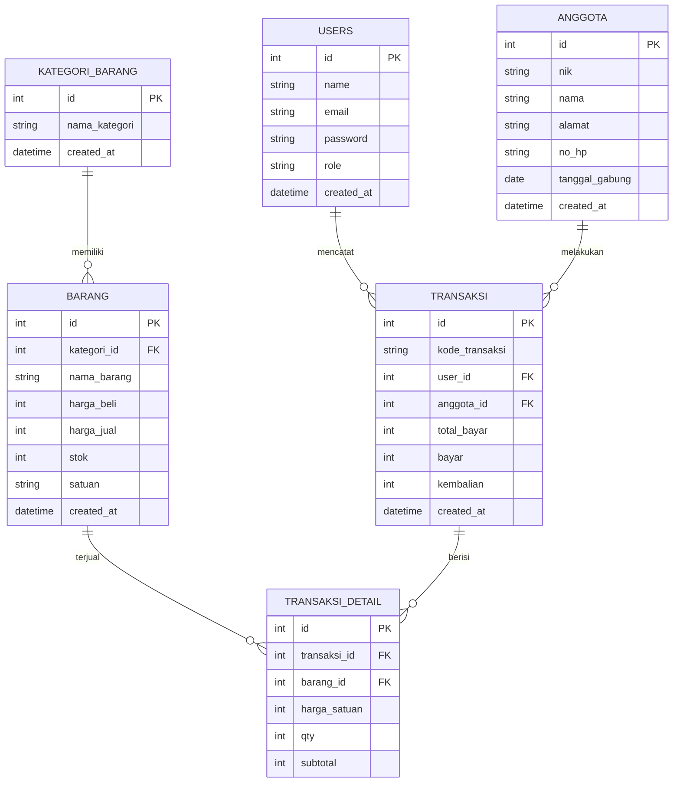
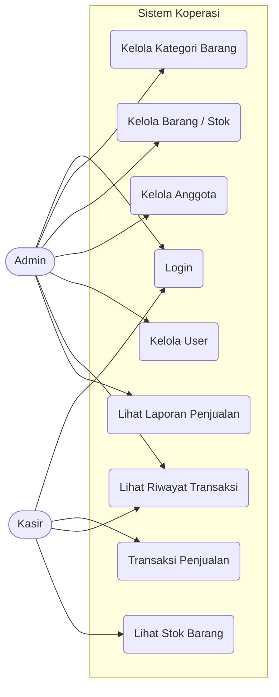
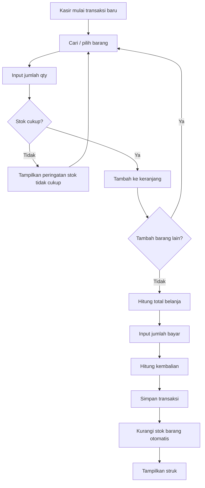

# Diagram Mermaid — Sistem Manajemen Koperasi Desa Merah Putih

## 1. Entity Relationship Diagram (ERD)



---

## 2. Use Case Diagram



---

## 3. Alur Transaksi Penjualan (Flowchart)



---

### Cara Pakai File Ini

- Bisa dibuka langsung di editor yang mendukung Mermaid (VS Code dengan extension "Markdown Preview Mermaid Support", Obsidian, atau GitHub — GitHub otomatis render blok ```mermaid```)
- Bisa juga di-paste ke [mermaid.live](https://mermaid.live) untuk lihat visualisasinya secara online dan export ke PNG/SVG
